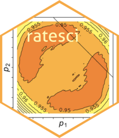

<!-- README.md is generated from README.Rmd. Please edit that file -->

# ratesci <a href="https://petelaud.github.io/ratesci/"></a>

<!-- badges: start -->

[](https://github.com/petelaud/ratesci/actions/workflows/R-CMD-check.yaml)
[](https://www.gnu.org/licenses/gpl-3.0)
[](https://cran.r-project.org/package=ratesci)
[](https://cranlogs.r-pkg.org/badges/grand-total/ratesci)
[](https://cranlogs.r-pkg.org/badges/ratesci)

<!-- badges: end -->

ratesci is an [R](https://www.r-project.org) package to compute
confidence intervals and tests for:

- a single binomial proportion, or Poisson rate (‘p’)
- a difference between binomial proportions or Poisson rates (risk
  difference or rate difference, ‘RD’)
- a ratio of proportions or rates (relative risk or rate ratio, ‘RR’)
- a binomial odds ratio (‘OR’)
- stratified calculations for any of the above
- paired binomial contrasts RD and RR
- paired odds ratio using the conditional model
- a binomial proportion from clustered data

A number of different methods are offered, but in each case, the
recommended default is based on asymptotic score methodology (from
([Wilson 1927](#ref-wilson1927)), ([Miettinen and Nurminen
1985](#ref-miettinen1985)) and ([Tango 1998](#ref-tango1998a))), but
including skewness corrections following the principles of ([Gart and
Nam 1988](#ref-gart1988)). The resulting family of skewness-corrected
asymptotic score (SCAS) methods ([Laud 2017](#ref-laud2017)), (and Laud
2025, under review) ensures equal-tailed coverage (or central location),
in other words for a nominal 95% confidence interval, the one-sided
non-coverage probability is (on average) close to 2.5% on each side.
Stratified calculations are also catered for (e.g. meta-analysis,
including random effects). Most of the above list is covered by
`scoreci()`, with the exception of clustered proportions (which are
handled by `clusterpci()`) and paired contrasts (`pairbinci()`). Options
are included for omitting the skewness correction to obtain legacy
methods such as stratified or unstratified Miettinen-Nurminen and Wilson
intervals, Tango intervals for paired data, or chi-squared, CMH,
Farrington-Manning or McNemar tests.

- See the vignettes for further details and examples of the SCAS and
  other intervals for the [single
  rate](https://petelaud.github.io/ratesci/articles/single_rate.html),
  [basic
  contrasts](https://petelaud.github.io/ratesci/articles/basic_contrasts.html),
  [stratified
  contrasts](https://petelaud.github.io/ratesci/articles/stratified.html),
  and [paired
  contrasts](https://petelaud.github.io/ratesci/articles/paired_contrasts.html).

In each case, the asymptotic score methods provide a matching hypothesis
test against any specified null parameter value, for a superiority test
or a non-inferiority test, with guaranteed coherence between the test
and interval. The superiority test is a variant of (and in many cases
identical to) a chi-squared test or CMH test, and the non-inferiority
test is analogous to a Farrington-Manning test, all with improved
control of type I error achieved by the bias and skewness corrections.
For paired proportions, the superiority test is a variant of the McNemar
test, incorporating an ‘N-1’ adjustment which appears to avoid any
violations of the nominal significance level.

- See the [hypothesis
  tests](https://petelaud.github.io/ratesci/articles/tests.html)
  vignette for further details of the relationships between SCAS tests
  and conventional chi-squared and CMH tests.

Another family of methods offered by the package, with reasonable
performance for large (single-stratum) sample sizes (but without a
matching hypothesis test), uses the Method of Variance Estimates
Recovery (MOVER), also known as Square-and-Add ([Newcombe 2012, chap.
7](#ref-newcombe2012)). These methods combine intervals calculated
separately for each proportion. The recommended default gives the
MOVER-J method, using Jeffreys equal-tailed intervals instead of the
Wilson method preferred by Newcombe. This improves on traditional
approximate methods with respect to one-sided and two-sided coverage,
particularly for the RR contrast, but does not match the performance of
the SCAS method. As the Jeffreys interval is based on a Bayesian
conjugate prior, the MOVER approach allows the option to incorporate
prior beliefs about the rates in each group - by default, the
non-informative Jeffreys $Beta(0.5, 0.5)$ priors are used (or
corresponding Gamma priors for Poisson rates). MOVER intervals are
available in `moverci()` for all contrasts of independent binomial and
Poisson rates, and in `pairbinci()` for the paired binomial contrasts.

For those wishing to achieve strictly conservative coverage, continuity
adjustments are provided as approximations to “exact” methods, with the
option to adjust the strength of the adjustment (as the Yates correction
is widely recognised to be an over-conservative adjustment). The
performance of these adjustments has not been extensively evaluated, but
they appear to be more successful for SCAS than for MOVER, in terms of
achieving conservative coverage.

An online calculator based on this package is available
[here](https://ssu.shef.ac.uk/ratesci/calc.php). Plots illustrating the
coverage properties of selected methods can be found
[here](https://github.com/petelaud/ratesci/tree/master/plots), and
[here](https://github.com/petelaud/cpplot/tree/master/plots).
<!--and [here](https://ssu.shef.ac.uk/diffbinconf/) with SCAS labelled as GNbc -->

## Installation

The current official
(i.e. [CRAN](https://CRAN.R-project.org/package=ratesci)) release can be
installed within R with:

``` r
install.packages("ratesci")
```

The latest development version of the package can be installed with:

``` r
# install.packages("pak")
pak::pak("petelaud/ratesci")
```

This builds the package from source based on the current version on
[GitHub](https://github.com/petelaud/ratesci)

## Example

Below is a basic example which shows you how to request a confidence
interval for the difference between proportions 5/56 - 0/29. The `$call`
output element shows that the default settings give an interval for the
risk difference (`contrast = "RD"`), for binomial proportions
(`distrib = "bin"`), at a 95% confidence level. Variance bias correction
(`bcf`) and skewness correction (`skew`) are applied, continuity
adjustment (`cc`) is not. This is the skewness-corrected asymptotic
score (“SCAS”) confidence interval. (For Miettinen-Nurminen, use
`skew = FALSE`, for Gart-Nam, use `bcf = FALSE`.)

``` r
library(ratesci)
scoreci(x1 = 5, n1 = 56, x2 = 0, n2 = 29)
#> $estimates
#>         lower     est  upper level x1 n1 x2 n2   p1hat p2hat   p1mle p2mle
#> [1,] -0.01862 0.09169 0.1867  0.95  5 56  0 29 0.08929     0 0.09169     0
#> 
#> $pval
#>      chisq pval2sided theta0 scorenull pval_left pval_right
#> [1,] 3.025      0.082      0     1.739     0.959      0.041
#> 
#> $call
#>  distrib contrast    level      bcf     skew       cc 
#>    "bin"     "RD"   "0.95"   "TRUE"   "TRUE"  "FALSE"
```

An example of a paired analysis follows, using the data from Table II of
([Fagerland, Lydersen, and Laake 2014](#ref-fagerland2014)). Here the
bias and skewness corrections are again applied by default. Omitting
both would produce the Tango asymptotic score interval for
`contrast = "RD"`, or the Tang method for `contrast = "RR"`.

``` r
pairbinci(x = c(1, 1, 7, 12))
#> $data
#>          Test_2
#> Test_1    Success Failure
#>   Success       1       1
#>   Failure       7      12
#> 
#> $estimates
#>        lower     est    upper level   p1hat p2hat  p1mle  p2mle phi_hat phi_c
#> [1,] -0.5281 -0.2859 -0.01842  0.95 0.09524 0.381 0.0952 0.3811 0.07954     0
#>      psi_hat
#> [1,]   1.714
#> 
#> $pval
#>      chisq pval2sided theta0 scorenull pval_left pval_right
#> [1,] 4.286    0.03843      0     -2.07   0.01922     0.9808
#> 
#> $call
#> contrast   method    level      bcf     skew       cc 
#>     "RD"  "Score"   "0.95"   "TRUE"   "TRUE"  "FALSE"
```

#### Overview

ratesci contains the following functions:

For comparisons of rates (contrasts RD, RR and OR):

- `scoreci()`: for score-based confidence intervals including SCAS,
  Miettinen-Nurminen and Gart-Nam, with or without stratification.
- `scasci()`: wrapper function to compute SCAS intervals.
- `tdasci()`: wrapper function to compute TDAS stratified intervals
  incorporating random effects.
- `moverci()`: for the MOVER methods, including Newcombe and MOVER-J.
- `moverbci()`: wrapper function to compute MOVER-B intervals.
- `pairbinci()`: for paired binomial data, including SCAS, asymptotic
  score and MOVER methods for RD and RR, and transformed binomial
  intervals for conditional OR.

For single binomial or Poisson rates:

- `scaspci()`: non-iterative SCAS method for a single rate. For
  stratified calculations use `scoreci()` with `contrast = "p"`.
- `jeffreysci()`: wrapper function to compute Jeffreys interval for a
  single rate (with option to incorporate prior information).
- `rateci()`: wrapper function for selected methods for a single rate,
  including SCAS, Jeffreys, midp and Clopper-Pearson/Garwood.
- `clusterpci()`: Saha’s Wilson-based interval for a single proportion
  based on clustered data, with a skewness-corrected version.

## References

<div id="refs" class="references csl-bib-body hanging-indent"
entry-spacing="0">

<div id="ref-fagerland2014" class="csl-entry">

Fagerland, Morten W., Stian Lydersen, and Petter Laake. 2014.
“Recommended Tests and Confidence Intervals for Paired Binomial
Proportions.” *Statistics in Medicine* 33 (16): 2850–75.
<https://doi.org/10.1002/sim.6148>.

</div>

<div id="ref-gart1988" class="csl-entry">

Gart, John J., and Jun-mo Nam. 1988. “Approximate Interval Estimation of
the Ratio of Binomial Parameters: A Review and Corrections for
Skewness.” *Biometrics* 44 (2): 323. <https://doi.org/10.2307/2531848>.

</div>

<div id="ref-laud2017" class="csl-entry">

Laud, Peter J. 2017. “Equal-Tailed Confidence Intervals for Comparison
of Rates.” *Pharmaceutical Statistics* 16 (5): 334–48.
<https://doi.org/10.1002/pst.1813>.

</div>

<div id="ref-miettinen1985" class="csl-entry">

Miettinen, Olli, and Markku Nurminen. 1985. “Comparative Analysis of Two
Rates.” *Statistics in Medicine* 4 (2): 213–26.
<https://doi.org/10.1002/sim.4780040211>.

</div>

<div id="ref-newcombe2012" class="csl-entry">

Newcombe, Robert G. 2012. *Confidence Intervals for Proportions and
Related Measures of Effect Size*. CRC Press.
<https://doi.org/10.1201/b12670>.

</div>

<div id="ref-tango1998a" class="csl-entry">

Tango, Toshiro. 1998. “Equivalence Test and Confidence Interval for the
Difference in Proportions for the Paired-Sample Design.” *Statistics in
Medicine* 17 (8): 891–908.
[https://doi.org/10.1002/(sici)1097-0258(19980430)17:8\<891::aid-sim780\>3.0.co;2-b](https://doi.org/10.1002/(sici)1097-0258(19980430)17:8<891::aid-sim780>3.0.co;2-b).

</div>

<div id="ref-wilson1927" class="csl-entry">

Wilson, Edwin B. 1927. “Probable Inference, the Law of Succession, and
Statistical Inference.” *Journal of the American Statistical
Association* 22 (158): 209–12.
<https://doi.org/10.1080/01621459.1927.10502953>.

</div>

</div>
