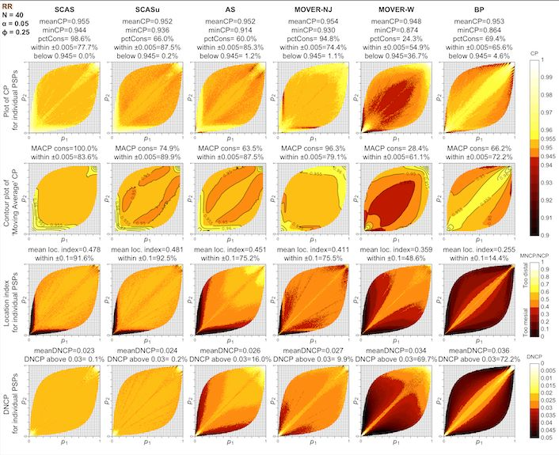

# 4: Paired contrasts

``` r
library(ratesci)
```

## Confidence intervals and tests for paired comparisons of binomial proportions

The input data for paired proportions takes a different structure,
compared with the data for independent proportions:

|         |         |                                       |                                   |                                       |
|---------|---------|---------------------------------------|-----------------------------------|---------------------------------------|
|         |         | Event B                               |                                   |                                       |
|         |         | Success                               | Failure                           | Total                                 |
| Event A | Success | $a\ \left( p_{11} \right)$            | $b\ \left( p_{12} \right)$        | $x_{1} = a + b\ \left( p_{1} \right)$ |
|         | Failure | $c\ \left( p_{21} \right)$            | $d\ \left( p_{22} \right)$        | $c + d\ \left( 1 - p_{1} \right)$     |
|         | Total   | $x_{2} = a + c\ \left( p_{2} \right)$ | $b + d\ \left( 1 - p_{2} \right)$ | $N$                                   |

### SCAS and other asymptotic score methods for RD and RR

To calculate a confidence interval (CI) for a paired risk difference
(${\widehat{\theta}}_{RD} = {\widehat{p}}_{1} - {\widehat{p}}_{2}$,
where ${\widehat{p}}_{1} = (a + b)/N$, ${\widehat{p}}_{2} = (a + c)/N$),
or relative risk
(${\widehat{\theta}}_{RR} = {\widehat{p}}_{1}/{\widehat{p}}_{2}$), the
skewness-corrected asymptotic score (SCAS) method is recommended, as one
that succeeds, on average, at containing the true parameter $\theta$
with the appropriate nominal probability (e.g. 95%), and has evenly
distributed tail probabilities (Laud 2025, under review). It is a
modified version of the asymptotic score methods by ([Tango
1998](#ref-tango1998)) for RD, and ([Nam and Blackwelder
2002](#ref-nam2002)) and ([Tang, Tang, and Chan 2003](#ref-tang2003))
for RR, incorporating both a skewness correction and a correction in the
variance estimate.

The plots below illustrate the one-sided and two-sided interval coverage
probabilities achieved by SCAS compared to some other popular
methods[¹](#fn1), when $N = 40$ and the correlation coefficient is 0.25.
A selection of coverage probability plots for other sample sizes and
correlations can be found in the “plots” folder of the [cpplot GitHub
repository](https://github.com/petelaud/cpplot/tree/master/plots).



[`pairbinci()`](https://petelaud.github.io/ratesci/reference/pairbinci.md)
takes input in the form of a vector of length 4, comprising the four
values `c(a, b, c, d)` from the above table, which are the number of
paired observations having each of the four possible pairs of outcomes.

For example, using the dataset from a study of airway reactivity in
children before and after stem cell transplantation, as used in
([Fagerland, Lydersen, and Laake 2014](#ref-fagerland2014)):

``` r
out <- pairbinci(x = c(1, 1, 7, 12))
out$estimates
#>       lower    est   upper level  p1hat p2hat  p1mle p2mle phi_hat phi_c
#> [1,] -0.528 -0.286 -0.0184  0.95 0.0952 0.381 0.0952 0.381  0.0795     0
#>      psi_hat
#> [1,]    1.71
```

The underlying z-statistic is used to obtain a two-sided hypothesis test
against the null hypothesis of no difference (`pval2sided`). Note that
this is equivalent to an ‘N-1’ adjusted version of the McNemar test. The
facility is also provided for a custom one-sided test against any
specified null hypothesis value $\theta_{0}$, e.g. for non-inferiority
testing (`pval_left` and `pval_right`).

``` r
out$pval
#>      chisq pval2sided theta0 scorenull pval_left pval_right
#> [1,]  4.29     0.0384      0     -2.07    0.0192      0.981
```

For a confidence interval for paired RR, use:

``` r
out <- pairbinci(x = c(1, 1, 7, 12), contrast = "RR")
out$estimates
#>       lower   est upper level  p1hat p2hat  p1mle p2mle phi_hat phi_c psi_hat
#> [1,] 0.0429 0.263 0.928  0.95 0.0952 0.381 0.0994 0.379  0.0795     0    1.71
out$pval
#>      chisq pval2sided theta0 scorenull pval_left pval_right
#> [1,]  4.29     0.0384      1     -2.07    0.0192      0.981
```

To obtain the legacy Tango and Tang intervals for RD and RR
respectively, you may set the `skew` and `bcf` arguments to `FALSE`.
Also switching to `method = "Score_closed"` takes advantage of
closed-form calculations for these methods (whereas the SCAS method is
solved by iteration).

### MOVER methods

For application of the MOVER method to paired RD or RR, an estimate of
the correlation coefficient is included in the formula. A correction to
the correlation estimate, introduced by Newcombe, is recommended,
obtained with `method = "MOVER_newc"`. As for unpaired MOVER methods,
the default base method used for the individual (marginal) proportions
is the equal-tailed Jeffreys interval, rather than the Wilson Score as
originally proposed by Newcombe (obtained using `moverbase = "wilson"`).
The combination of the Newcombe correlation estimate and the Jeffreys
intervals gives the designation “MOVER-NJ”. This method is less
computationally intensive than SCAS, but coverage properties are
inferior, and there is no corresponding hypothesis test.

``` r
pairbinci(x = c(1, 1, 7, 12), contrast = "RD", method = "MOVER_newc")$estimates
#>       lower    est   upper level  p1hat p2hat phi_hat
#> [1,] -0.511 -0.286 -0.0324  0.95 0.0952 0.381       0
```

For cross-checking against published example in ([Fagerland, Lydersen,
and Laake 2014](#ref-fagerland2014))

``` r
pairbinci(x = c(1, 1, 7, 12), contrast = "RD", method = "MOVER_newc", moverbase = "wilson")$estimates
#>       lower    est   upper level  p1hat p2hat phi_hat
#> [1,] -0.507 -0.286 -0.0256  0.95 0.0952 0.381       0
```

### Conditional odds ratio

Confidence intervals for paired odds ratio are obtained conditional on
the number of discordant pairs, by transforming a confidence interval
for the proportion $b/(b + c)$. Transformed SCAS (with or without a
variance bias correction, to ensure consistency with the above SCAS
hypothesis tests for RD and RR) or transformed mid-p intervals are
recommended (Laud 2025, under review).

``` r
out <- pairbinci(x = c(1, 1, 7, 12), contrast = "OR")
out$estimates
#>       lower   est upper
#> [1,] 0.0077 0.162 0.912
out$pval
#>      chisq pval2sided theta0 scorenull pval_left pval_right
#> [1,]  4.29     0.0384      1     -2.07    0.0192      0.981
```

To select an alternative method, for example transformed mid-p:

``` r
pairbinci(x = c(1, 1, 7, 12), contrast = "OR", method = "midp")$estimates
#>        lower  est upper   x     n
#> [1,] 0.00629 0.16 0.924 Inf -1.14
```

## References

Fagerland, Morten W., Stian Lydersen, and Petter Laake. 2014.
“Recommended Tests and Confidence Intervals for Paired Binomial
Proportions.” *Statistics in Medicine* 33 (16): 2850–75.
<https://doi.org/10.1002/sim.6148>.

Nam, Jun-mo, and William C. Blackwelder. 2002. “Analysis of the Ratio of
Marginal Probabilities in a Matched-Pair Setting.” *Statistics in
Medicine* 21 (5): 689–99. <https://doi.org/10.1002/sim.1017>.

Tang, Nian-Sheng, Man-Lai Tang, and Ivan Siu Fung Chan. 2003. “On Tests
of Equivalence via Non-Unity Relative Risk for Matched-Pair Design.”
*Statistics in Medicine* 22 (8): 1217–33.
<https://doi.org/10.1002/sim.1213>.

Tango, Toshiro. 1998. “Equivalence Test and Confidence Interval for the
Difference in Proportions for the Paired-Sample Design.” *Statistics in
Medicine* 17 (8): 891–908.
<https://doi.org/10.1002/(sici)1097-0258(19980430)17:8%3C891::aid-sim780%3E3.0.co;2-b>.

------------------------------------------------------------------------

1.  SCASu = SCAS omitting variance bias correction; AS = Tang; MOVER-NJ
    = Method of Variance Estimates Recovery, based on Newcombe’s
    correlation adjustment but using Jeffreys equal-tailed intervals
    instead of Wilson; MOVER-W = MOVER using Wilson intervals, and
    omitting Newcombe’s correlation correction; BP = Bonett-Price
