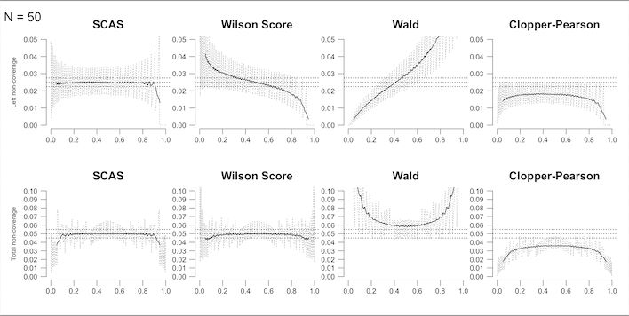

# 1: Single rate

``` r
library(ratesci)
```

## Estimation of a single binomial or Poisson rate

To calculate a confidence interval for a single binomial proportion
($\widehat{p} = x/n$), the skewness-corrected asymptotic score (SCAS)
method is recommended, as one that succeeds, on average, at containing
the true proportion p with the appropriate nominal probability
(e.g. 95%), and has evenly distributed tail probabilities ([Laud
2017](#ref-laud2017), Appendix S3.5). It is a modified version of the
Wilson score method. The plot below illustrates the one-sided and
two-sided non-coverage probability (i.e. 1 minus the actual probability
that the interval contains the true value of p) achieved by SCAS
compared to some other popular methods, using moving average smoothing
(solid lines):



Similar patterns of coverage are seen for the corresponding methods for
a Poisson rate ([Laud 2017](#ref-laud2017)). (Analysis for Poisson
rates, such as exposure-adjusted adverse event rates) is obtained using
`distrib = "poi"`, with the input `n` representing the exposure time.)

For a worked example, the SCAS 95% interval for the binomial proportion
1/29 is obtained with
[`scaspci()`](https://petelaud.github.io/ratesci/reference/scaspci.md),
using closed-form calculation ([Laud 2017](#ref-laud2017), Appendix
A.4):

``` r
scaspci(x = 1, n = 29)
#> $estimates
#>        lower    est upper x  n
#> [1,] 0.00199 0.0398 0.155 1 29
#> 
#> $call
#> distrib   level     bcf      cc 
#>   "bin"  "0.95" "FALSE" "FALSE"
```

If you prefer the slightly slower iterative calculation, or want to
perform a corresponding [hypothesis
test](https://petelaud.github.io/ratesci/articles/tests.html), you could
use:

``` r
scoreci(x1 = 1, n1 = 29, contrast = "p")$estimates
#>        lower    est upper level x1 n1  p1hat  p1mle
#> [1,] 0.00199 0.0398 0.155  0.95  1 29 0.0345 0.0398
```

[`rateci()`](https://petelaud.github.io/ratesci/reference/rateci.md)
also provides two other confidence interval methods (Jeffreys and mid-p)
with similar coverage properties ([Laud 2018](#ref-laud2018)):

``` r
rateci(x = 1, n = 29)
#> $scas
#>        lower    est upper x  n
#> [1,] 0.00199 0.0345 0.155 1 29
#> 
#> $jeff
#>        lower    est upper x  n
#> [1,] 0.00375 0.0345  0.15 1 29
#> 
#> $midp
#>        lower    est upper x  n
#> [1,] 0.00172 0.0345 0.159 1 29
#> 
#> $midp_beta
#>        lower    est upper x  n
#> [1,] 0.00467 0.0345 0.149 1 29
#> 
#> $wilson
#>        lower    est upper x  n
#> [1,] 0.00611 0.0345 0.172 1 29
#> 
#> $wald
#>                           x  n
#> [1,] -0.0319 0.0345 0.101 1 29
#> 
#> $ciarray
#> , , 1
#> 
#>                  lower    est upper x  n
#> SCAS           0.00199 0.0345 0.155 1 29
#> Jeffreys       0.00375 0.0345 0.150 1 29
#> mid-p          0.00172 0.0345 0.159 1 29
#> mid-p(beta)    0.00467 0.0345 0.149 1 29
#> Wilson         0.00611 0.0345 0.172 1 29
#> Wald          -0.03193 0.0345 0.101 1 29
#> Agresti-Coull -0.00842 0.0345 0.186 1 29
#> 
#> 
#> $call
#> distrib   level      cc std_est 
#>   "bin"  "0.95" "FALSE"  "TRUE"
```

The Jeffreys interval can also incorporate prior information about $p$
for an approximate Bayesian confidence interval. For example, a pilot
study estimate of 1/10 could be used to update the non-informative
$Beta(0.5,0.5)$ prior for $p$ to a $Beta(1.5,9.5)$ distribution:

``` r
jeffreysci(x = 1, n = 29, ai = 1.5, bi = 9.5)
#> $estimates
#>       lower    est upper x  n
#> [1,] 0.0108 0.0553 0.154 1 29
#> 
#> $call
#> distrib   level      cc     adj      ai      bi 
#>   "bin"  "0.95"     "0"  "TRUE"   "1.5"   "9.5"
```

If more conservative coverage is required, a continuity adjustment may
be deployed with `cc`, as follows, giving continuity-adjusted SCAS or
Jeffreys, and (if `cc` is TRUE or 0.5), the Clopper-Pearson method.

``` r
rateci(x = 1, n = 29, cc = TRUE)
#> $scas_cc
#>         lower    est upper x  n
#> [1,] 6.19e-06 0.0345 0.182 1 29
#> 
#> $jeff_cc
#>         lower    est upper x  n
#> [1,] 0.000873 0.0345 0.178 1 29
#> 
#> $cp
#>         lower    est upper x  n
#> [1,] 0.000873 0.0345 0.178 1 29
#> 
#> $cp_beta
#>         lower    est upper x  n
#> [1,] 0.000873 0.0345 0.178 1 29
#> 
#> $ciarray
#> , , 1
#> 
#>                      lower    est upper x  n
#> SCAS_cc           6.19e-06 0.0345 0.182 1 29
#> Jeffreys_cc       8.73e-04 0.0345 0.178 1 29
#> Clopper-Pearson   8.73e-04 0.0345 0.178 1 29
#> CP(beta)          8.73e-04 0.0345 0.178 1 29
#> Wilson_cc         1.80e-03 0.0345 0.196 1 29
#> Wald_cc          -4.92e-02 0.0345 0.118 1 29
#> Agresti-Coull_cc -2.36e-02 0.0345 0.202 1 29
#> 
#> 
#> $call
#> distrib   level      cc std_est 
#>   "bin"  "0.95"   "0.5"  "TRUE"
```

Such an adjustment is widely acknowledged to be over-conservative, so
intermediate adjustments such as `cc = 0.25` give a more refined
adjustment([Laud 2017](#ref-laud2017), Appendix S2 ($\gamma = cc$)).

``` r
rateci(x = 1, n = 29, cc = 0.25)
#> $scas_cc
#>         lower    est upper x  n
#> [1,] 0.000605 0.0345 0.169 1 29
#> 
#> $jeff_cc
#>        lower    est upper x  n
#> [1,] 0.00205 0.0345 0.164 1 29
#> 
#> $beta_cc
#>        lower    est upper x  n
#> [1,] 0.00277 0.0345 0.163 1 29
#> 
#> $ciarray
#> , , 1
#> 
#>                      lower    est upper x  n
#> SCAS_cc           0.000605 0.0345 0.169 1 29
#> Jeffreys_cc       0.002052 0.0345 0.164 1 29
#> mid-p_cc          0.001162 0.0345 0.169 1 29
#> mid-p(beta)_cc    0.002770 0.0345 0.163 1 29
#> Wilson_cc         0.003766 0.0345 0.184 1 29
#> Wald_cc          -0.040547 0.0345 0.110 1 29
#> Agresti-Coull_cc -0.016030 0.0345 0.194 1 29
#> 
#> 
#> $call
#> distrib   level      cc std_est 
#>   "bin"  "0.95"  "0.25"  "TRUE"
```

### Stratified datasets

For stratified datasets (e.g. data collected in different subgroups or
collated across different studies), use
[`scoreci()`](https://petelaud.github.io/ratesci/reference/scoreci.md)
with `contrast = "p"` and `stratified = TRUE` (again, the skewness
correction is recommended, but may be omitted for a stratified Wilson
interval).

By default, a fixed effect analysis is produced, i.e. one which assumes
a common true parameter p across strata. The default stratum weighting
uses the inverse variance of the score underlying the SCAS/Wilson
method, evaluated at the maximum likelihood estimate for the pooled
proportion (thus avoiding infinite weights for boundary cases).
Alternative weights are sample size (`weighting = "MH"`) or custom
user-specified weights supplied via the `wt` argument. For example,
population weighting would be applied via a vector (e.g. `wt = Ni`)
containing the true population size represented by each stratum. (Note
this is not divided by the sample size per stratum, because the
weighting is applied at the group level, not the case level.)

Below is an illustration using control arm data from a meta-analysis of
9 trials studying postoperative deep vein thrombosis (DVT). This may be
a somewhat unrealistic example, as the main focus of these studies is to
estimate the effect of a treatment, rather than to estimate the
underlying risk of an event.

``` r
data(compress, package = "ratesci")
strat_p <- scoreci(x1 = compress$event.control, 
                   n1 = compress$n.control, 
                   contrast = "p", 
                   stratified = TRUE)
strat_p$estimates
#>      lower   est upper level p1hat p1mle
#> [1,] 0.181 0.212 0.245  0.95 0.212 0.212
```

The function also outputs p-values for a two-sided hypothesis test
against a default null hypothesis p = 0.5, and one-sided tests against a
user-specified value of $\theta_{0}$:

``` r
strat_p$pval
#>      chisq pval2sided theta0 scorenull pval_left pval_right
#> [1,]   208   4.05e-47    0.5     -14.4  2.02e-47          1
```

The `Qtest` output object provides a heterogeneity test and related
quantities. In this instance, there appears to be significant
variability between studies in the underlying event rate for the control
group, which may reflect different characteristics of the populations in
each study leading to different underlying risk. (Note this need not
prevent the evaluation of stratified treatment comparisons):

``` r
strat_p$Qtest
#>            Q         Q_df     pval_het           I2         tau2           Qc 
#>     6.37e+01     8.00e+00     8.84e-11     8.74e+01     1.74e-02     0.00e+00 
#> pval_qualhet 
#>     9.96e-01
```

Per-stratum estimates are produced, including stratum weights and
contributions to the Q-statistic. Here the studies contributing most are
the 3rd and 8th study, with estimated proportions of 0.48 (95% CI: 0.34
to 0.62) and 0.04 (95% CI: 0.01 to 0.10) respectively:

``` r
strat_p$stratdata
#>       x1j n1j p1hatj wt_fixed wtpct_fixed wtpct_rand theta_j lower_j upper_j
#>  [1,]  37 103 0.3592    616.0       16.43      16.43  0.3597  0.2713   0.455
#>  [2,]   5  10 0.5000     59.8        1.59       1.59  0.5000  0.2175   0.782
#>  [3,]  23  48 0.4792    287.1        7.66       7.66  0.4793  0.3419   0.619
#>  [4,]  16 110 0.1455    657.8       17.54      17.54  0.1465  0.0888   0.221
#>  [5,]   7  32 0.2188    191.4        5.10       5.10  0.2216  0.1021   0.384
#>  [6,]   8  25 0.3200    149.5        3.99       3.99  0.3224  0.1626   0.517
#>  [7,]  17 126 0.1349    753.5       20.10      20.10  0.1359  0.0835   0.203
#>  [8,]   4  92 0.0435    550.2       14.67      14.67  0.0451  0.0143   0.101
#>  [9,]  16  81 0.1975    484.4       12.92      12.92  0.1988  0.1219   0.294
#>           V_j Stheta_j      Q_j
#>  [1,] 0.00162  0.14695 13.30145
#>  [2,] 0.01672  0.28773  4.95092
#>  [3,] 0.00348  0.26689 20.44757
#>  [4,] 0.00152 -0.06682  2.93717
#>  [5,] 0.00523  0.00648  0.00803
#>  [6,] 0.00669  0.10773  1.73503
#>  [7,] 0.00133 -0.07735  4.50878
#>  [8,] 0.00182 -0.16880 15.67615
#>  [9,] 0.00206 -0.01474  0.10529
```

For a random effects analysis, use `random = TRUE`. (This may not give a
meaningful estimate of stratum variation if the number of strata is
small.)

``` r
strat_p_rand <- scoreci(x1 = compress$event.control, 
                        n1 = compress$n.control, 
                        contrast = "p", 
                        stratified = TRUE, 
                        random = TRUE,
                        prediction = TRUE)
strat_p_rand$estimates
#>      lower  est upper level p1hat p1mle
#> [1,] 0.136 0.25 0.364  0.95  0.25  0.25
strat_p_rand$pval
#>      chisq pval2sided theta0 scorenull pval_left pval_right
#> [1,]  25.2    0.00102    0.5     -5.02  0.000511      0.999
```

A prediction interval, representing an expected proportion in a new
study ([Higgins, Thompson, and Spiegelhalter 2008](#ref-higgins2008)),
can be obtained using `prediction = TRUE`:

``` r
strat_p_rand$prediction
#>      lower upper
#> [1,]     0 0.571
```

### Clustered datasets

For clustered data, use
[`clusterpci()`](https://petelaud.github.io/ratesci/reference/clusterpci.md),
which applies the Wilson-based method proposed by ([Saha, Miller, and
Wang 2015](#ref-saha2015)), and a skewness-corrected version. (This
function currently only applies for binomial proportions.)

``` r
  # Data from Liang 1992
  x <- c(rep(c(0, 1), c(36, 12)),
          rep(c(0, 1, 2), c(15, 7, 1)),
          rep(c(0, 1, 2, 3), c(5, 7, 3, 2)),
          rep(c(0, 1, 2), c(3, 3, 1)),
          c(0, 2, 3, 4, 6))
  n <- c(rep(1, 48),
          rep(2, 23),
          rep(3, 17),
          rep(4, 7),
          rep(6, 5))
  # Wilson-based interval as per Saha et al.
  clusterpci(x, n, skew = FALSE)
#> $estimates
#>       lower    est  upper totx totn xihat    icc
#> [1,] 0.2285 0.2956 0.3728   60  203 1.349 0.1855
#> 
#> $pval
#>      theta0 scorenull pval_left pval_right
#> [1,]    0.5    -5.015 2.647e-07          1
#> 
#> $call
#>   level    skew      cc 
#>  "0.95" "FALSE" "FALSE"
  # Skewness-corrected version
  clusterpci(x, n, skew = TRUE)
#> $estimates
#>       lower    est  upper  x   n totx totn xihat    icc
#> [1,] 0.2276 0.2958 0.3724 60 203   60  203 1.349 0.1855
#> 
#> $pval
#>      theta0 scorenull pval_left pval_right
#> [1,]    0.5    -5.015 2.647e-07          1
#> 
#> $call
#>   level    skew      cc 
#>  "0.95"  "TRUE" "FALSE"
```

## Technical details

The SCAS method is an extension of the Wilson score method, using the
same score function $S(p) = x/n - p$, where $x$ is the observed number
of events from $n$ trials, and $p$ is the true proportion. The variance
of $S(p)$ is $V = p(1 - p)/n$, and the 3rd central moment is
$\mu_{3} = p(1 - p)(1 - 2p)/n^{2}$. The $100(1 - \alpha)\%$ confidence
interval is found as the two solutions (solving for p) of the following
equation, where $z$ is the $1 - \alpha/2$ percentile of the standard
normal distribution:

$$S(p)/V^{1/2} - \left( z^{2} - 1 \right)\mu_{3}/6V^{3/2} = \pm z$$

For unstratified datasets, this has a closed-form solution. The formula
is extended in ([Laud 2017](#ref-laud2017)) to incorporate
stratification using inverse variance weights, $w_{i} = 1/V_{i}$, or
sample size, $w_{i} = n_{i}$, or any other weighting scheme as required,
with the solution being found by iteration over
$p \in \lbrack 0,1\rbrack$.

The hypothesis tests are based on the same equation, but solving to find
the value of the test statistic z for the given null proportion p.

The Jeffreys interval is obtained as $\alpha/2$ and $1 - \alpha/2$
quantiles of the $Beta(x + 0.5,n - x + 0.5)$ distribution, with boundary
modifications when $x = 0$ or $x = n$([Brown, Cai, and DasGupta
2001](#ref-brown2001)).

A Clopper-Pearson interval may also be obtained as quantiles of a beta
distribution ([Brown, Cai, and DasGupta 2001](#ref-brown2001)), using
$Beta(x,n - x + 1)$ for the lower confidence limit, and
$Beta(x + 1,n - x)$ for the upper limit.

## References

Brown, Lawrence D., T. Tony Cai, and Anirban DasGupta. 2001. “Interval
Estimation for a Binomial Proportion.” *Statistical Science* 16 (2).
<https://doi.org/10.1214/ss/1009213286>.

Higgins, Julian P. T., Simon G. Thompson, and David J. Spiegelhalter.
2008. “A Re-Evaluation of Random-Effects Meta-Analysis.” *Journal of the
Royal Statistical Society Series A: Statistics in Society* 172 (1):
137–59. <https://doi.org/10.1111/j.1467-985x.2008.00552.x>.

Laud, Peter J. 2017. “Equal-Tailed Confidence Intervals for Comparison
of Rates.” *Pharmaceutical Statistics* 16 (5): 334–48.
<https://doi.org/10.1002/pst.1813>.

———. 2018. “Equal-Tailed Confidence Intervals for Comparison of Rates.”
*Pharmaceutical Statistics* 17 (3): 290–93.
<https://doi.org/10.1002/pst.1855>.

Saha, Krishna K., Daniel Miller, and Suojin Wang. 2015. “A Comparison of
Some Approximate Confidence Intervals for a Single Proportion for
Clustered Binary Outcome Data.” *The International Journal of
Biostatistics* 12 (2). <https://doi.org/10.1515/ijb-2015-0024>.
