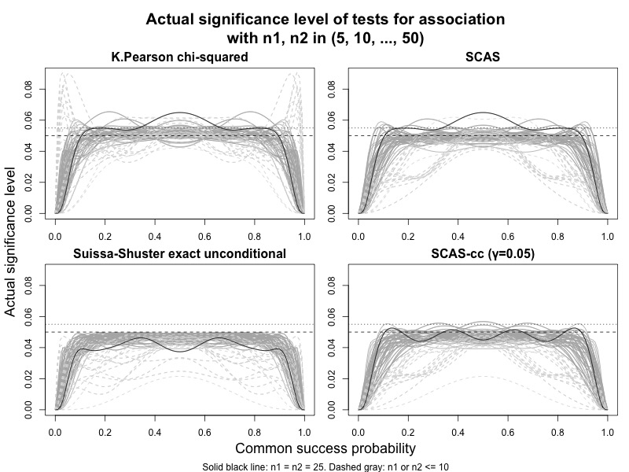

# 5: Hypothesis tests

``` r
library(ratesci)
```

## Test for association and equivalence test produced by scoreci() and pairbinci()

If you want to know whether the observed proportion in group 1 is
“significantly different” from the proportion in group 2, then you need
a test for association, or superiority test. Such a test is based on the
null hypothesis that $p_{1} = p_{2}$ (i.e. $\theta_{RD} = 0$,
$\theta_{RR} = 1$, or $\theta_{OR} = 1$). The superiority tests
described below give consistent results whichever contrast is chosen
(RD, RR or OR).

Sometimes, you might want to demonstrate the opposite, i.e. that the
proportion in group 1 is not smaller (or not larger) than the proportion
in group 2. For example, if you want to show that a new treatment is at
least as effective as an established comparator. In this case you need a
non-inferiority test. If the outcome measure is positive (e.g cure
rate), the null hypothesis for such a test would be
$\theta_{RD} \leq \theta_{0}$ (where $\theta_{0} < 0$), or
$\theta_{RR} \leq \theta_{0}$ (where $\theta_{0} < 1$). $\theta_{0}$ is
called the “non-inferiority margin”. The direction of the inequalities
would be reversed for a negative outcome such as adverse event rate.

To demonstrate equivalence (i.e. no difference in either direction), you
would conduct two one-sided tests, e.g. with $\theta_{0} = - 0.1$ and
$\theta_{0} = + 0.1$. If the tests are each conducted using a 2.5%
significance level, the null hypothesis would be rejected if the
corresponding 95% confidence interval falls entirely within
$( - 0.1,0.1)$.

### Unstratified superiority test (2x2 test for association)

The p-value for the test for association is named `pval2sided` in the
[`scoreci()`](https://petelaud.github.io/ratesci/reference/scoreci.md)
output. When the skewness correction is omitted, this test is equivalent
to the Egon Pearson ‘N-1’ chi-squared test, which has been recommended
over the conventional Karl Pearson test ([Campbell
2007](#ref-campbell2007)):

``` r
scoreci(x1 = 7, n1 = 34, x2 = 1, n = 34, skew = FALSE)$pval[, 1:2]
#>      chisq pval2sided 
#>      5.025      0.025
scoreci(x1 = 7, n1 = 34, x2 = 1, n = 34, skew = FALSE, contrast = "RR")$pval[, 1:2]
#>      chisq pval2sided 
#>      5.025      0.025
scoreci(x1 = 7, n1 = 34, x2 = 1, n = 34, skew = FALSE, contrast = "OR")$pval[, 1:2]
#>      chisq pval2sided 
#>      5.025      0.025
suppressWarnings(k_pearson <- chisq.test(x = matrix(c(7, 1, 27, 33), nrow = 2), correct = FALSE)$statistic)
pchisq(k_pearson * ((34+34-1)/(34+34)), df = 1, lower.tail = FALSE)
#> X-squared 
#>     0.025
```

The direct equivalence with the ‘N-1’ chi-squared test also holds when
the skewness correction is included, if group sizes are equal (see
below). If group sizes are unequal, then the SCAS two-sided test is an
improved variant of the chi-squared test.

``` r
scoreci(x1 = 7, n1 = 34, x2 = 1, n = 34, skew = TRUE)$pval[, 1:2]
#>      chisq pval2sided 
#>      5.025      0.025
```

The plot below illustrates the type I error rates achieved by different
tests for small to medium equal and unequal sample sizes. The skewness
corrected test fixes a deficiency of the chi-squared test, which can
severely violate the nominal significance level when group sample sizes
differ by a factor of 4 or more. The SCAS test does not guarantee that
the nominal significance level is never violated, but rather fluctuates
around it, in a similar manner to the “lucky n” phenomenon for the
single proportion described by ([Brown, Cai, and DasGupta
2001](#ref-brown2001)). Violations are relatively infrequent (22%, vs
44% for chi-squared), with significance level rarely exceeding 5.5% (3%,
vs 11% for chi-squared), and converging towards the nominal 5% for
larger sample sizes. The example case with $n_{1} = n_{2} = 25$ (solid
black curve) plotted by ([Fagerland MW 2017, fig.
4.4](#ref-fagerland2017)) is very unrepresentative, and remains an
anomolous case for the SCAS test, while type I error rates for unequal
sample sizes are generally shifted downwards. For further improved
control of type I error, a small continuity adjustment ($\gamma = 0.05$)
applied to the SCAS test achieves performance that is more successful
than the Fisher mid-P test at approximating the Suissa-Shuster exact
unconditional test.



### Unstratified non-inferiority test

The `pval` item in the
[`scoreci()`](https://petelaud.github.io/ratesci/reference/scoreci.md)
output also includes `pval_left` and `pval_right`, for a pair of
one-sided tests conducted against a user-specified value of the contrast
parameter, $\theta_{0}$, to cater for non-zero or non-unity null
hypotheses for equivalence or non-inferiority tests. Only one of these
tests will be used in any given case - depending on whether the outcome
is positive (e.g. cure rate) or negative (e.g. mortality rate). For
example, if the outcome measure is a cure rate, and you want to
demonstrate non-inferiority of a new treatment, you might set a
non-inferiority margin for RD as -0.1, and use `pval_right` (the
probability of the observed data or a larger difference to the right, if
the true difference is $\theta_{0}$) for the one-sided test. Whereas if
the outcome measure was mortality rate, the direction of
“non-inferiority” is reversed, so you would use a positive value for
$\theta_{0}$ with `pval_left`.

The one-sided test is analogous to the Farrington-Manning test, but not
identical to it, due to the ‘N-1’ variance bias correction and skewness
correction, both of which provide improved control of type I error (see
([Laud 2017](#ref-laud2017)), and ([Laud and Dane 2014](#ref-laud2014)),
which used the label GNbc for SCAS. Note the type I error for the
Farrington-Manning test is identical to the one-sided coverage
probability for the Mee interval).

See below for an example analysis of a clinical trial testing the
non-inferiority of cure rates for a new antibiotic against an
established comparator treatment, with a non-inferiority margin of
-12.5% ([Torres et al. 2018](#ref-torres2018)):

``` r
reprove <- scoreci(x1 = 245, n1 = 356, x2 = 270, n2 = 370, theta0 = -0.125)
reprove$estimates
#>       lower     est  upper level  x1  n1  x2  n2 p1hat p2hat p1mle p2mle
#> [1,] -0.108 -0.0415 0.0246  0.95 245 356 270 370 0.688  0.73 0.688  0.73
reprove$pval[, 3:6]
#>     theta0  scorenull  pval_left pval_right 
#>   -0.12500    2.47516    0.99334    0.00666
```

### Stratified test

For stratified datasets (2 x 2 x k tables), an often-used “conventional”
test for association is the Cochran-Mantel-Haenszel (CMH) test. Unlike
in the single stratum case, the CMH test already incorporates the ‘N-1’
variance bias correction.

[`scoreci()`](https://petelaud.github.io/ratesci/reference/scoreci.md)
permits a range of different weighting schemes for stratified analysis.
When Mantel-Haenszel weighting is used for `contrast = "RD"` or
`contrast = "RR"`, or INV weighting is used for `contrast = "OR"`, or if
MN weighting is used for any of the three binomial contrasts, then the
test for association produced by
[`scoreci()`](https://petelaud.github.io/ratesci/reference/scoreci.md)
is the CMH test. If INV weighting is used, then Radhakrishna’s optimal
contrast-specific test is produced (see below). If the skewness
correction is applied, then the tests are skewness-corrected versions of
those tests, and if group sizes are equal in all strata, the skewness
correction term is zero.

The one-sided test is analogous to a stratified version of an ‘N-1’
adjusted and skewness-corrected Farrington-Manning test. This is
achieved by reframing Miettinen-Nurminen’s score statistic as a normally
distributed z-statistic instead of a chi-squared statistic.

For example, analysis of the above clinical trial is repeated with
adjustment for a stratification factor (geographic region) as follows:

``` r
x1 = c(21, 76, 73, 75) 
n1 = c(29, 96, 124, 107) 
x2 = c(19, 73, 91, 87) 
n2 = c(27, 95, 130, 118)
data_array <- aperm(array(c(x1, x2, n1 - x1, n2 - x2), dim = c(4, 2, 2)), c(2, 3, 1))

reprove_strat <- scoreci(x1 = c(21, 76, 73, 75), 
                         n1 = c(29, 96, 124, 107), 
                         x2 = c(19, 73, 91, 87), 
                         n2 = c(27, 95, 130, 118),
                         stratified = TRUE,
                         theta0 = -0.125) 
reprove_strat$pval
#>      chisq pval2sided theta0 scorenull pval_left pval_right
#> [1,]   1.6      0.206 -0.125      2.45     0.993    0.00711
reprove_cmh <- mantelhaen.test(data_array, correct = FALSE)
reprove_cmh$p.value
#> [1] 0.206
```

### Weights for an optimal test

The CMH test (obtained as a test for RD or RR with MH weights, or a test
for OR with INV weights) has been shown to be optimal if the treatment
effect is constant over strata on the odds ratio scale (see
([Radhakrishna 1965](#ref-radhakrishna1965))). If instead the treatment
effect is constant on the difference scale, then INV weighting for RD is
optimal. If the treatment effect is constant across strata on the
relative risk scale, then the optimal test is produced by a test for RR
= 1 with `weighting = "INV"`, and `rr_tang = TRUE`, which applies the
modified score function in ([Tang 2020](#ref-tang2020)). Naturally, one
does not know in advance which one of these assumptions might hold.
Mehrotra and Railkar proposed ‘Minimum Risk’ weighting as a compromise
between INV and MH weighting, which may be implemented in a future
update.

### Tests for paired binomial proportions

The two-sided test given by
[`pairbinci()`](https://petelaud.github.io/ratesci/reference/pairbinci.md)
(for any contrast) is an ‘N-1’ adjusted version of the McNemar test (the
skewness correction term is zero at the null hypothesis value of
$\theta$). In an extensive evaluation of many thousands of sample sizes
and correlations, the paired SCAS two-sided test did not violate the
nominal significance level at any point, suggesting that the
over-conservative “continuity corrected” version given by default in
[`mcnemar.test()`](https://rdrr.io/r/stats/mcnemar.test.html) is
superfluous.

``` r
pairbinci(x = c(1, 1, 7, 12), skew = TRUE)$pval
#>      chisq pval2sided theta0 scorenull pval_left pval_right
#> [1,]  4.29     0.0384      0     -2.07    0.0192      0.981
pairbinci(x = c(1, 1, 7, 12), skew = FALSE)$pval
#>      chisq pval2sided theta0 scorenull pval_left pval_right
#> [1,]  4.29     0.0384      0     -2.07    0.0192      0.981
pairbinci(x = c(1, 1, 7, 12), skew = FALSE, contrast = "RR")$pval
#>      chisq pval2sided theta0 scorenull pval_left pval_right
#> [1,]  4.29     0.0384      1     -2.07    0.0192      0.981
mcnem <- mcnemar.test(x = matrix(c(1, 1, 7, 12), nrow = 2), correct = FALSE)$statistic
names(mcnem) <- NULL
pchisq(mcnem * (21-1)/21, df = 1, lower.tail = FALSE)
#> [1] 0.0384
```

The paired one-sided test is a skewness-corrected and ‘N-1’ adjusted
version of Nam’s score test ([Nam 1997](#ref-nam1997)). Type I error
rates for this test, represented by one-sided confidence interval
non-coverage probabilities, are examined in \[Laud2025, under
evaluation\].

### Test for a single proportion

[`scoreci()`](https://petelaud.github.io/ratesci/reference/scoreci.md)
with `contrast = "p"` also provides hypothesis tests for unstratified or
stratified datasets, matching the confidence intervals. `pval2sided` is
a two-sided test against the null hypothesis that $p = 0.5$. `pval_left`
and `pval_right` are one-sided tests against a user-specified value of
$\theta_{0}$.

``` r
scoreci(x1 = 7, n1 = 34, contrast = "p", theta0 = 0.1)$pval
#>      chisq pval2sided theta0 scorenull pval_left pval_right
#> [1,]  11.8   0.000604    0.1      1.87     0.969     0.0309
```

## References

Brown, Lawrence D., T. Tony Cai, and Anirban DasGupta. 2001. “Interval
Estimation for a Binomial Proportion.” *Statistical Science* 16 (2).
<https://doi.org/10.1214/ss/1009213286>.

Campbell, Ian. 2007. “Chi-Squared and FisherIrwin Tests of Two-by-Two
Tables with Small Sample Recommendations.” *Statistics in Medicine* 26
(19): 3661–75. <https://doi.org/10.1002/sim.2832>.

Fagerland MW, Laake P, Lydersen S. 2017. *Statistical Analysis of
Contingency Tables*. Chapman & Hall/CRC, Boca Raton, FL.
<https://contingencytables.com>.

Laud, Peter J. 2017. “Equal-Tailed Confidence Intervals for Comparison
of Rates.” *Pharmaceutical Statistics* 16 (5): 334–48.
<https://doi.org/10.1002/pst.1813>.

Laud, Peter J., and Aaron Dane. 2014. “Confidence Intervals for the
Difference Between Independent Binomial Proportions: Comparison Using a
Graphical Approach and Moving Averages.” *Pharmaceutical Statistics* 13
(5): 294–308. <https://doi.org/10.1002/pst.1631>.

Nam, Jun-mo. 1997. “Establishing Equivalence of Two Treatments and
Sample Size Requirements in Matched-Pairs Design.” *Biometrics* 53 (4):
1422. <https://doi.org/10.2307/2533508>.

Radhakrishna, S. 1965. “Combination of Results from Several 2 x 2
Contingency Tables.” *Biometrics* 21 (1): 86.
<https://doi.org/10.2307/2528354>.

Tang, Yongqiang. 2020. “Score Confidence Intervals and Sample Sizes for
Stratified Comparisons of Binomial Proportions.” *Statistics in
Medicine* 39 (24): 3427–57. <https://doi.org/10.1002/sim.8674>.

Torres, Antoni, Nanshan Zhong, Jan Pachl, Jean-François Timsit, Marin
Kollef, Zhangjing Chen, Jie Song, et al. 2018. “Ceftazidime-Avibactam
Versus Meropenem in Nosocomial Pneumonia, Including
Ventilator-Associated Pneumonia (REPROVE): A Randomised, Double-Blind,
Phase 3 Non-Inferiority Trial.” *The Lancet Infectious Diseases* 18 (3):
285–95. <https://doi.org/10.1016/s1473-3099(17)30747-8>.
