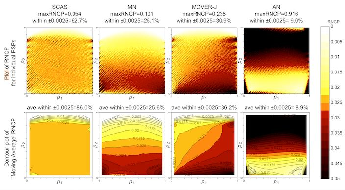
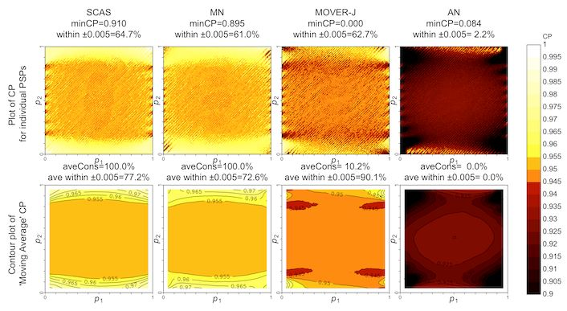

```{r, include = FALSE}
knitr::opts_chunk$set(
  collapse = TRUE,
  comment = "#>"
)
options(digits = 3)

```

```{r setup}
library(ratesci)
```

## Introduction to scoreci() and related functions for computing confidence intervals and tests for comparisons of independent binomial or Poisson rates

### SCAS and other asymptotic score methods

To calculate a confidence interval (CI) for a risk difference ($\hat \theta_{RD} = \hat p_1 - \hat p_2$, where $\hat p_i = x_i/n_i$), or relative risk ($\hat \theta_{RR} = \hat p_1 / \hat p_2$) or odds ratio ($\hat \theta_{OR} = \hat p_1 (1 - \hat p_2) / \hat p_2(1 - \hat p_1)$, the Skewness-Corrected Asymptotic Score (SCAS) method is recommended, as one that succeeds, on average, at containing the true parameter $\theta$ with the appropriate nominal probability (e.g. 95%), and has evenly distributed tail probabilities [@laud2017]. It is a modified version of the Miettinen-Nurminen (MN) Asymptotic Score method [@miettinen1985]. MN and SCAS each represent a family of methods encompassing analysis of RD and RR for binomial proportions or Poisson rates (e.g. exposure-adjusted incidence rate), and binomial OR.

The plots below illustrate the one-sided and two-sided interval coverage probabilities[^1] achieved by SCAS compared to some other popular methods[^2] with $(n_1, n_2) = (45, 15)$, with the second row of each plot using moving average smoothing. A selection of coverage probability plots for other sample size combinations and other contrasts can be found in the "plots" folder of the [ratesci GitHub repository](https://github.com/petelaud/ratesci/tree/master/plots).

[^1]: RNCP = the probability that the true value of $\theta$ falls outside to the right of the confidence interval. CP = the probability that the confidence interval contains the true value of $\theta$. Both calculated by precise enumeration of bivariate binomial probabilities.

[^2]: AN = "Wald" Approximate Normal, MOVER-J = Method of Variance Estimates Recovery, based on Newcombe's method but using Jeffreys equal-tailed intervals instead of Wilson



Differences in two-sided coverage can be more subtle:



The skewness correction, introduced by [@gart1988] should be considered essential for analysis of ratio contrasts, but can also have a substantial effect for RD as seen here.

[Note: [@fagerland2011] dismissed the MN method, saying that it can be somewhat liberal. In fact, based on reconstruction of their results, it appears that their evaluation was of the closely-related but inferior Mee method, which omits the N/(N-1) variance bias correction. I do not have access to their 2017 book to see if the error persists there. Essentially, it seems they reject the MN method on the basis of some very small regions of the parameter space where coverage is slightly below nominal. These dips in coverage do occur, but fluctuate above and below the nominal level in a pattern of ridges and furrows aligned along the diagonal of a fixed value of $\theta_{RD}$. The most severe dips tend to occur when sample sizes are multiples of 10 (e.g. $(n_1, n_2) = (40, 10)$), which might be relatively rare in practice. The moving average smoothing in the above surface plots is designed to even out these fluctuations in coverage. The 'N-1' adjustment in the MN method elevates coverage probabilities slightly, and the skewness correction gives a further improvement overall, as well as substantially improving one-sided coverage when group sizes are unequal.]

`scoreci()` is used as follows, for example to obtain a SCAS 95% CI for the difference `5/56 - 0/29`:

```{r}
out <- scoreci(x1 = 5, n1 = 56, x2 = 0, n = 29)
out$estimates
```

````{=html}
<!---
For a Miettinen-Nurminen interval, set the argument `skew = FALSE`. For the closely-related Mee method, the variance bias correction would also be omitted:

```{r}
scoreci(x1 = 5, n1 = 56, x2 = 0, n = 29, skew = FALSE)$estimates
scoreci(x1 = 5, n1 = 56, x2 = 0, n = 29, skew = FALSE, bcf = FALSE)$estimates
```
--->
````

The underlying z-statistic is used to obtain a two-sided hypothesis test against the null hypothesis of no difference (`pval2sided`). Note that under certain conditions (i.e. $n_1 = n_2$) this is equivalent to the Egon Pearson 'N-1' chi-squared test [@campbell2007]. The facility is also provided for a custom one-sided test against any specified null hypothesis value $\theta_0$, e.g. for non-inferiority testing (`pval_left` and `pval_right`)

```{r}
out$pval
```

The `scoreci()` function provides options to omit the skewness correction (for the MN method) and the variance bias correction (for the Mee method, which would be consistent with the Karl Pearson unadjusted chi-squared test). For a simpler life, choose SCAS always and use the `scasci()` wrapper function:

```{r}
scasci(x1 = 5, n1 = 56, x2 = 0, n = 29)$estimates
```

For a confidence interval for the relative risk, use:

```{r}
scasci(x1 = 5, n1 = 56, x2 = 0, n = 29, contrast = "RR")$estimates
```

And for odds ratio:

```{r}
scasci(x1 = 5, n1 = 56, x2 = 0, n = 29, contrast = "OR")$estimates
```

For analysis of Poisson incidence rates, for example exposure-adjusted adverse event rates, the same methodology is adapted for the Poisson distribution, with the `distrib` argument. So, for example if the denominators 56 and 29 represent the number of patient-years at risk in each group, instead of the number of patients:

```{r}
scasci(x1 = 5, n1 = 56, x2 = 0, n = 29, contrast = "RR", distrib = "poi")$estimates
```

### MOVER methods

An alternative family of methods to produce confidence intervals for the same set of binomial and Poisson contrasts is the Method of Variance Estimates Recovery (MOVER), also known as Square-and-Add [For technical details see chapter 7 of @newcombe2012]. Originally labelled as a "Score" method [@newcombe1998] due to the involvement of the Wilson Score interval, this involves a combination of intervals calculated separately for $p_1$ and $p_2$. Newcombe based his method on Wilson intervals, but coverage can be improved by using equal-tailed Jeffreys intervals instead ("MOVER-J") [@laud2017][^3]. Coverage properties remain generally inferior to SCAS - with larger sample sizes, MOVER-J has two-sided coverage close to (but slightly below) the nominal level, but central location is not achieved (except for the RR contrast). There is no corresponding hypothesis test for the MOVER methods.

[^3]: Newcombe considered a MOVER method based on equal-tailed Jeffreys intervals ("MOVER-R Jeffreys") in chapter 11 of [@newcombe2012]. However, the example intervals shown in his Table 11.6 do not match the output of `moverci(2, 14, 1, 11, contrast = "RR", type = "jeff")`. The results for "MOVER-R Wilson" are matched by `moverci(2, 14, 1, 11, contrast = "RR", type = "wilson")`, suggesting that the discrepancy is in the calculation of the Jeffreys intervals themselves rather than the MOVER formula. However, Jeffreys intervals for a single proportion ("method 12") in Newcombe's Table 3.2 (chapter 3), are matched by `jeffreysci(1, 10)`, so the source of the discrepancy remains a mystery. Similar discrepancies are observed for contrast = "OR".

A MOVER-J interval for binomial RD from the same observed data as above would be obtained using:

```{r}
moverci(x1 = 5, n1 = 56, x2 = 0, n = 29)
```

For comparison, Newcombe's version using Wilson intervals is:

```{r}
moverci(x1 = 5, n1 = 56, x2 = 0, n = 29, type = "wilson")
```

The MOVER approach may be further modified by adapting the Jeffreys interval (which uses a non-informative $Beta(0.5, 0.5)$ prior for the group rates) to incorporate prior information about $p_1$ and $p_2$ for an approximate Bayesian interval. For example, given data from a pilot study with 1/10 events in the first group and 0/10 in the second group, the non-informative $Beta(0.5, 0.5)$ prior distributions for $p_1$ and $p_2$ might be updated as follows:

```{r}
moverbci(x1 = 5, n1 = 56, x2 = 0, n = 29, a1 = 1.5, b1 = 9.5, a2 = 0.5, b2 = 10.5)
```

WARNING: Note that confidence intervals for ratio measures should be equivariant, in the sense that:

1.  interchanging the groups produces reciprocal intervals for RR or OR, i.e. the lower and upper confidence limits for $x_1/n_1$ vs $x_2/n_2$ are the reciprocal of the upper and lower limits for $x_2/n_2$ vs $x_1/n_1$
2.  in addition for OR, interchanging events and non-events produces reciprocal intervals, i.e. the lower and upper confidence limits for the odds ratio of $(n_1 - x_1)/n_1$ vs $(n_2 - x_2)/n_2$ are the reciprocal of the upper and lower limits for $x_1/n_1$ vs $x_2/n_2$.

Unfortunately, the MOVER method for contrast = "OR", as described in [@fagerland2012], does not satisfy the second of these requirements.

## References
