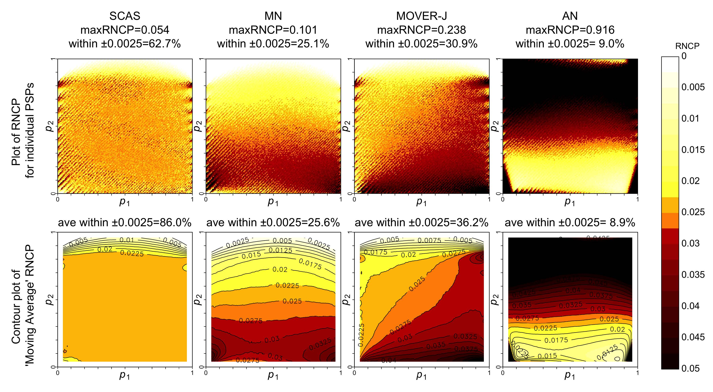

```{r, include = FALSE}
knitr::opts_chunk$set(
  collapse = TRUE,
  comment = "#>"
)
options(digits = 3)

```

```{r setup}
library(ratesci)
```

## Introduction to scoreci() and related functions for computing confidence intervals and tests for comparisons of independent binomial or Poisson rates

To calculate a confidence interval (CI) for a risk difference ($\hat \theta_{RD} = \hat p_1 - \hat p_2$, where $\hat p_i = x_i/n_i$), or relative risk ($\hat \theta_{RR} = \hat p_1 / \hat p_2$) or odds ratio ($\hat \theta_{OR} = \hat p_1 (1 - \hat p_2) / \hat p_2(1 - \hat p_1)$, the Skewness-Corrected Asymptotic Score (SCAS) method is recommended, as one that succeeds, on average, at containing the true parameter $\theta$ with the appropriate nominal probability (e.g. 95%), and has evenly distributed tail probabilities [@laud2017]. It is a modified version of the Miettinen-Nurminen (MN) Asymptotic Score method[@miettinen1985]. MN and SCAS each represent a family of methods encompassing analysis of RD and RR for binomial proportions or Poisson 'exposure-adjusted' rates, and binomial OR.

The plot below illustrates the one-sided interval non-coverage probability (i.e. 1 minus the actual probability that the 1-sided 97.5% confidence interval contains the true value of $\theta$) achieved by SCAS compared to some other popular methods[^1], using moving average smoothing:

[^1]: AN = "Wald" Approximate Normal, MOVER-J = Method of Variance Estimates Recovery, based on Newcombe's method but using Jeffreys equal-tailed intervals instead of Wilson



The skewness correction, introduced by Gart and Nam in 1988[@gart1988] should be considered essential for analysis of ratio contrasts, but can also have a substantial effect for RD as seen here.

The 'scoreci()' function is used as follows, for example to obtain a SCAS 95% CI for the difference 5/56 minus 0/29:

```{r}
out <- scoreci(x1 = 5, n1 = 56, x2 = 0, n = 29)
out$estimates
```

````{=html}
<!---
For a Miettinen-Nurminen interval, set the argument `skew = FALSE`. For the closely-related Mee method, the variance bias correction would also be omitted:

```{r}
scoreci(x1 = 5, n1 = 56, x2 = 0, n = 29, skew = FALSE)$estimates
scoreci(x1 = 5, n1 = 56, x2 = 0, n = 29, skew = FALSE, bcf = FALSE)$estimates
```
--->
````

The underlying z-statistic is used to obtain a two-sided hypothesis test against the null hypothesis of no difference (`pval2sided`). Note that under certain conditions (i.e. n1 = n2) this is equivalent to the Egon Pearson 'N-1' chi-squared test (<https://rpubs.com/seriousstats/epcs_test>). The facility is also provided for a custom one-sided test against any specified null hypothesis value $\theta_0$, e.g. for non-inferiority testing (`pval_left` and `pval_right`)

```{r}
out$pval
```

The `scoreci()` function provides options to omit the skewness correction (for the MN method) and the variance bias correction (for the Mee method, which would be consistent with the Karl Pearson unadjusted Chi-squared test). For a simpler life, choose SCAS always and use the `scasci()` wrapper function:

```{r}
scasci(x1 = 5, n1 = 56, x2 = 0, n = 29)$estimates
```

For a confidence interval for the relative risk, use:

```{r}
scasci(x1 = 5, n1 = 56, x2 = 0, n = 29, contrast = "RR")$estimates
```

And for odds ratio:

```{r}
scasci(x1 = 5, n1 = 56, x2 = 0, n = 29, contrast = "OR")$estimates
```

For analysis of Poisson incidence rates, for example exposure-adjusted adverse event rates, the same methodology is adapted for the Poisson distribution, with the `distrib` argument. So, for example if the denominators 56 and 29 represent number of patient-years at risk, instead of number of patients:

```{r}
scasci(x1 = 5, n1 = 56, x2 = 0, n = 29, contrast = "RR", distrib = "poi")$estimates
```
