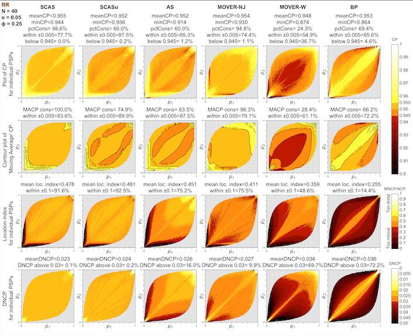

```{r, include = FALSE}
knitr::opts_chunk$set(
  collapse = TRUE,
  comment = "#>"
)
options(digits = 3)
```

```{r setup}
library(ratesci)
```

## Confidence intervals and tests for paired comparisons of binomial proportions

The input data for paired proportions takes a different structure, compared with the data for independent proportions:

|  |  |  |  |  |
|---------------|---------------|---------------|---------------|---------------|
|  |  | Event B |  |  |
|  |  | Success | Failure | Total |
| Event A | Success | $a \ (p_{11})$ | $b \ (p_{12})$ | $x_1 = a + b \ (p_1)$ |
|  | Failure | $c \ (p_{21})$ | $d \ (p_{22})$ | $c + d \ (1 -p_1)$ |
|  | Total | $x_2 = a + c \ (p_2)$ | $b + d \ (1 - p_2)$ | $N$ |

### SCAS and other asymptotic score methods for RD and RR

To calculate a confidence interval (CI) for a paired risk difference ($\hat \theta_{RD} = \hat p_1 - \hat p_2$, where $\hat p_1 = (a+b)/N$, $\hat p_2 = (a+c)/N$), or relative risk ($\hat \theta_{RR} = \hat p_1 / \hat p_2$), the skewness-corrected asymptotic score (SCAS) method is recommended, as one that succeeds, on average, at containing the true parameter $\theta$ with the appropriate nominal probability (e.g. 95%), and has evenly distributed tail probabilities (Laud 2025, under review). It is a modified version of the asymptotic score methods by [@tango1998] for RD, and [@nam2002] and [@tang2003] for RR, incorporating both a skewness correction and a correction in the variance estimate.

The plots below illustrate the one-sided and two-sided interval coverage probabilities achieved by SCAS compared to some other popular methods[^1], when $N=40$ and the correlation coefficient is 0.25. A selection of coverage probability plots for other sample sizes and correlations can be found in the "plots" folder of the [cpplot GitHub repository](https://github.com/petelaud/cpplot/tree/master/plots).

[^1]: SCASu = SCAS omitting variance bias correction; AS = Tang; MOVER-NJ = Method of Variance Estimates Recovery, based on Newcombe's correlation adjustment but using Jeffreys equal-tailed intervals instead of Wilson; MOVER-W = MOVER using Wilson intervals, and omitting Newcombe's correlation correction; BP = Bonett-Price



`pairbinci()` takes input in the form of a vector of length 4, comprising the four values `c(a, b, c, d)` from the above table, which are the number of paired observations having each of the four possible pairs of outcomes.

For example, using the dataset from a study of airway reactivity in children before and after stem cell transplantation, as used in [@fagerland2014]:

```{r}
out <- pairbinci(x = c(1, 1, 7, 12))
out$estimates
```

The underlying z-statistic is used to obtain a two-sided hypothesis test against the null hypothesis of no difference (`pval2sided`). Note that this is equivalent to an 'N-1' adjusted version of the McNemar test. The facility is also provided for a custom one-sided test against any specified null hypothesis value $\theta_0$, e.g. for non-inferiority testing (`pval_left` and `pval_right`).

```{r}
out$pval
```

For a confidence interval for paired RR, use:

```{r}
out <- pairbinci(x = c(1, 1, 7, 12), contrast = "RR")
out$estimates
out$pval
```

To obtain the legacy Tango and Tang intervals for RD and RR respectively, you may set the `skew` and `bcf` arguments to `FALSE`. Also switching to `method = "Score_closed"` takes advantage of closed-form calculations for these methods (whereas the SCAS method is solved by iteration).

### MOVER methods

For application of the MOVER method to paired RD or RR, an estimate of the correlation coefficient is included in the formula. A correction to the correlation estimate, introduced by Newcombe, is recommended, obtained with `method = "MOVER_newc"`. As for unpaired MOVER methods, the default base method used for the individual (marginal) proportions is the equal-tailed Jeffreys interval, rather than the Wilson Score as originally proposed by Newcombe (obtained using `moverbase = "wilson"`). The combination of the Newcombe correlation estimate and the Jeffreys intervals gives the designation "MOVER-NJ". This method is less computationally intensive than SCAS, but coverage properties are inferior, and there is no corresponding hypothesis test.

```{r}
pairbinci(x = c(1, 1, 7, 12), contrast = "RD", method = "MOVER_newc")$estimates
```

For cross-checking against published example in [@fagerland2014]

```{r}
pairbinci(x = c(1, 1, 7, 12), contrast = "RD", method = "MOVER_newc", moverbase = "wilson")$estimates
```

### Conditional odds ratio

Confidence intervals for paired odds ratio are obtained conditional on the number of discordant pairs, by transforming a confidence interval for the proportion $b / (b+c)$. Transformed SCAS (with or without a variance bias correction, to ensure consistency with the above SCAS hypothesis tests for RD and RR) or transformed mid-p intervals are recommended (Laud 2025, under review).

```{r}
out <- pairbinci(x = c(1, 1, 7, 12), contrast = "OR")
out$estimates
out$pval
```

To select an alternative method, for example transformed mid-p:

```{r}
pairbinci(x = c(1, 1, 7, 12), contrast = "OR", method = "midp")$estimates
```
## References


