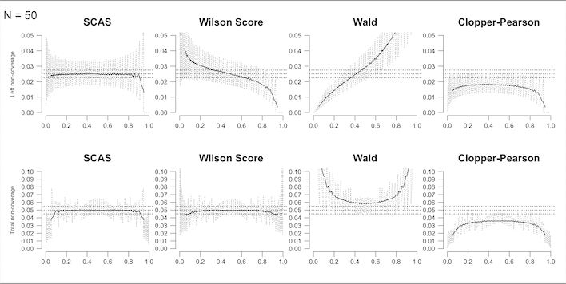

```{r, include = FALSE}
knitr::opts_chunk$set(
  collapse = TRUE,
  comment = "#>"
)
options(digits = 3)
```

```{r setup}
library(ratesci)
```

## Estimation of a single binomial or Poisson rate

To calculate a confidence interval for a single binomial proportion ($\hat p = x/n$), the skewness-corrected asymptotic score (SCAS) method is recommended, as one that succeeds, on average, at containing the true proportion p with the appropriate nominal probability (e.g. 95%), and has evenly distributed tail probabilities [@laud2017, Appendix S3.5]. It is a modified version of the Wilson score method. The plot below illustrates the one-sided and two-sided non-coverage probability (i.e. 1 minus the actual probability that the interval contains the true value of p) achieved by SCAS compared to some other popular methods, using moving average smoothing (solid lines):



Similar patterns of coverage are seen for the corresponding methods for a Poisson rate [@laud2017]. (Analysis for Poisson rates, such as exposure-adjusted adverse event rates) is obtained using `distrib = "poi"`, with the input `n` representing the exposure time.)

For a worked example, the SCAS 95% interval for the binomial proportion 1/29 is obtained with `scaspci()`, using closed-form calculation [@laud2017, Appendix A.4]:

```{r}
scaspci(x = 1, n = 29)
```

If you prefer the slightly slower iterative calculation, or want to perform a corresponding [hypothesis test](https://petelaud.github.io/ratesci/articles/tests.html), you could use:

```{r}
scoreci(x1 = 1, n1 = 29, contrast = "p")$estimates
```

`rateci()` also provides two other confidence interval methods (Jeffreys and mid-p) with similar coverage properties [@laud2018]:

```{r}
rateci(x = 1, n = 29)
```

The Jeffreys interval can also incorporate prior information about $p$ for an approximate Bayesian confidence interval. For example, a pilot study estimate of 1/10 could be used to update the non-informative $Beta(0.5, 0.5)$ prior for $p$ to a $Beta(1.5, 9.5)$ distribution:

```{r}
jeffreysci(x = 1, n = 29, ai = 1.5, bi = 9.5)
```

If more conservative coverage is required, a continuity adjustment may be deployed with `cc`, as follows, giving continuity-adjusted SCAS or Jeffreys, and (if `cc` is TRUE or 0.5), the Clopper-Pearson method.

```{r}
rateci(x = 1, n = 29, cc = TRUE)
```

Such an adjustment is widely acknowledged to be over-conservative, so intermediate adjustments such as `cc = 0.25` give a more refined adjustment[@laud2017, Appendix S2 ($\gamma = cc$)].

```{r}
rateci(x = 1, n = 29, cc = 0.25)
```

### Stratified datasets

For stratified datasets (e.g. data collected in different subgroups or collated across different studies), use `scoreci()` with `contrast = "p"` and `stratified = TRUE` (again, the skewness correction is recommended, but may be omitted for a stratified Wilson interval).

By default, a fixed effect analysis is produced, i.e. one which assumes a common true parameter p across strata. The default stratum weighting uses the inverse variance of the score underlying the SCAS/Wilson method, evaluated at the maximum likelihood estimate for the pooled proportion (thus avoiding infinite weights for boundary cases). Alternative weights are sample size (`weighting = "MH"`) or custom user-specified weights supplied via the `wt` argument. For example, population weighting would be applied via a vector (e.g. `wt = Ni`) containing the true population size represented by each stratum. (Note this is not divided by the sample size per stratum, because the weighting is applied at the group level, not the case level.)

Below is an illustration using control arm data from a meta-analysis of 9 trials studying postoperative deep vein thrombosis (DVT). This may be a somewhat unrealistic example, as the main focus of these studies is to estimate the effect of a treatment, rather than to estimate the underlying risk of an event.

```{r}
data(compress, package = "ratesci")
strat_p <- scoreci(x1 = compress$event.control, 
                   n1 = compress$n.control, 
                   contrast = "p", 
                   stratified = TRUE)
strat_p$estimates
```

The function also outputs p-values for a two-sided hypothesis test against a default null hypothesis p = 0.5, and one-sided tests against a user-specified value of $\theta_0$:

```{r}
strat_p$pval
```

The `Qtest` output object provides a heterogeneity test and related quantities. In this instance, there appears to be significant variability between studies in the underlying event rate for the control group, which may reflect different characteristics of the populations in each study leading to different underlying risk. (Note this need not prevent the evaluation of stratified treatment comparisons):

```{r}
strat_p$Qtest
```

Per-stratum estimates are produced, including stratum weights and contributions to the Q-statistic. Here the studies contributing most are the 3rd and 8th study, with estimated proportions of 0.48 (95% CI: 0.34 to 0.62) and 0.04 (95% CI: 0.01 to 0.10) respectively:

```{r}
strat_p$stratdata
```

For a random effects analysis, use `random = TRUE`. (This may not give a meaningful estimate of stratum variation if the number of strata is small.)

```{r}
strat_p_rand <- scoreci(x1 = compress$event.control, 
                        n1 = compress$n.control, 
                        contrast = "p", 
                        stratified = TRUE, 
                        random = TRUE,
                        prediction = TRUE)
strat_p_rand$estimates
strat_p_rand$pval
```

A prediction interval, representing an expected proportion in a new study [@higgins2008], can be obtained using `prediction = TRUE`:

```{r}
strat_p_rand$prediction
```

### Clustered datasets

For clustered data, use `clusterpci()`, which applies the Wilson-based method proposed by [@saha2015], and a skewness-corrected version. (This function currently only applies for binomial proportions.)

```{r, include = FALSE}
options(digits = 4)
```

```{r}
  # Data from Liang 1992
  x <- c(rep(c(0, 1), c(36, 12)),
          rep(c(0, 1, 2), c(15, 7, 1)),
          rep(c(0, 1, 2, 3), c(5, 7, 3, 2)),
          rep(c(0, 1, 2), c(3, 3, 1)),
          c(0, 2, 3, 4, 6))
  n <- c(rep(1, 48),
          rep(2, 23),
          rep(3, 17),
          rep(4, 7),
          rep(6, 5))
  # Wilson-based interval as per Saha et al.
  clusterpci(x, n, skew = FALSE)
  # Skewness-corrected version
  clusterpci(x, n, skew = TRUE)
```

## Technical details

The SCAS method is an extension of the Wilson score method, using the same score function $S(p) = x / n - p$, where $x$ is the observed number of events from $n$ trials, and $p$ is the true proportion. The variance of $S(p)$ is $V = p(1 - p)/n$, and the 3rd central moment is $\mu_3 = p(1 - p)(1 - 2p)/n^2$. The $100(1 - \alpha)\%$ confidence interval is found as the two solutions (solving for p) of the following equation, where $z$ is the $1 - \alpha / 2$ percentile of the standard normal distribution:

$$
S(p)/V^{1/2} - (z^2 - 1)\mu_3/6V^{3/2} = \pm z
$$

For unstratified datasets, this has a closed-form solution. The formula is extended in [@laud2017] to incorporate stratification using inverse variance weights, $w_i = 1 / V_i$, or sample size, $w_i = n_i$, or any other weighting scheme as required, with the solution being found by iteration over $p \in [0, 1]$.

The hypothesis tests are based on the same equation, but solving to find the value of the test statistic z for the given null proportion p.

The Jeffreys interval is obtained as $\alpha / 2$ and $1 - \alpha / 2$ quantiles of the $Beta(x + 0.5, n - x + 0.5)$ distribution, with boundary modifications when $x = 0$ or $x = n$ [@brown2001].

A Clopper-Pearson interval may also be obtained as quantiles of a beta distribution [@brown2001], using $Beta(x, n - x + 1)$ for the lower confidence limit, and $Beta(x + 1, n - x)$ for the upper limit.

<!-- The mid-p interval requires iteration to identify limits satisfying the inequalities specified ... -->

<!-- ## Additional details -->

<!-- Confidence intervals for a single binomial proportion, x/n, have a long history. The 'classic' ('conventional' / 'textbook') method everyone learns about in school is known as the Wald method, based on a large-sample "simple asymptotic" Normal approximation. It is easily demonstrated that this method generally fails to achieve the nominal confidence level, even when n is quite large. In other words, a 95% Wald confidence interval will contain the true value of p less than 95% of the time. For small proportions, the actual coverage can be alarmingly low. the Wald method can also produce intervals that contain impossible negative values of p, and an extremely unrealistic interval of [0, 0] when x = 0. -->

## References
