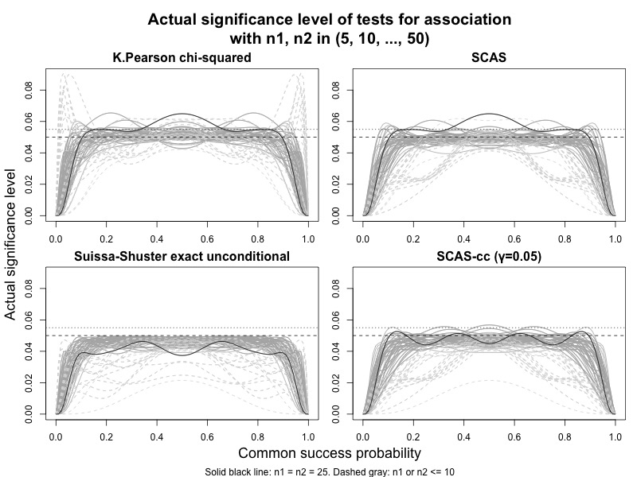

```{r, include = FALSE}
knitr::opts_chunk$set(
  collapse = TRUE,
  comment = "#>"
)
options(digits = 3)
```

```{r setup}
library(ratesci)
```

## Test for association and equivalence test produced by scoreci() and pairbinci()

If you want to know whether the observed proportion in group 1 is "significantly different" from the proportion in group 2, then you need a test for association, or superiority test. Such a test is based on the null hypothesis that $p_1 = p_2$ (i.e. $\theta_{RD} = 0$, $\theta_{RR} = 1$, or $\theta_{OR} = 1$). The superiority tests described below give consistent results whichever contrast is chosen (RD, RR or OR).

Sometimes, you might want to demonstrate the opposite, i.e. that the proportion in group 1 is not smaller (or not larger) than the proportion in group 2. For example, if you want to show that a new treatment is at least as effective as an established comparator. In this case you need a non-inferiority test. If the outcome measure is positive (e.g cure rate), the null hypothesis for such a test would be $\theta_{RD} ≤ \theta_0$ (where $\theta_0 < 0$), or $\theta_{RR} ≤ \theta_0$ (where $\theta_0 < 1$). $\theta_0$ is called the "non-inferiority margin". The direction of the inequalities would be reversed for a negative outcome such as adverse event rate.

To demonstrate equivalence (i.e. no difference in either direction), you would conduct two one-sided tests, e.g. with $\theta_0 = -0.1$ and $\theta_0 = +0.1$. If the tests are each conducted using a 2.5% significance level, the null hypothesis would be rejected if the corresponding 95% confidence interval falls entirely within $(-0.1, 0.1)$.

### Unstratified superiority test (2x2 test for association)

The p-value for the test for association is named `pval2sided` in the `scoreci()` output. When the skewness correction is omitted, this test is equivalent to the Egon Pearson 'N-1' chi-squared test, which has been recommended over the conventional Karl Pearson test [@campbell2007]:

````{=html}
<!---
```{r}
scoreci(x1 = 5, n1 = 56, x2 = 0, n = 29, skew = FALSE)$pval[, 1:2]
scoreci(x1 = 5, n1 = 56, x2 = 0, n = 29, skew = FALSE, contrast = "RR")$pval[, 1:2]
scoreci(x1 = 5, n1 = 56, x2 = 0, n = 29, skew = FALSE, contrast = "OR")$pval[, 1:2]
suppressWarnings(k_pearson <- chisq.test(x = matrix(c(5, 51, 0, 29), nrow = 2), correct = FALSE)$statistic)
pchisq(k_pearson * ((56+29-1)/(56+29)), df = 1, lower.tail = FALSE)
```
-->
````

```{r}
scoreci(x1 = 7, n1 = 34, x2 = 1, n = 34, skew = FALSE)$pval[, 1:2]
scoreci(x1 = 7, n1 = 34, x2 = 1, n = 34, skew = FALSE, contrast = "RR")$pval[, 1:2]
scoreci(x1 = 7, n1 = 34, x2 = 1, n = 34, skew = FALSE, contrast = "OR")$pval[, 1:2]
suppressWarnings(k_pearson <- chisq.test(x = matrix(c(7, 1, 27, 33), nrow = 2), correct = FALSE)$statistic)
pchisq(k_pearson * ((34+34-1)/(34+34)), df = 1, lower.tail = FALSE)
```

The direct equivalence with the 'N-1' chi-squared test also holds when the skewness correction is included, if group sizes are equal (see below). If group sizes are unequal, then the SCAS two-sided test is an improved variant of the chi-squared test.

```{r}
scoreci(x1 = 7, n1 = 34, x2 = 1, n = 34, skew = TRUE)$pval[, 1:2]
```

The plot below illustrates the type I error rates achieved by different tests for small to medium equal and unequal sample sizes. The skewness corrected test fixes a deficiency of the chi-squared test, which can severely violate the nominal significance level when group sample sizes differ by a factor of 4 or more. The SCAS test does not guarantee that the nominal significance level is never violated, but rather fluctuates around it, in a similar manner to the "lucky n" phenomenon for the single proportion described by [@brown2001]. Violations are relatively infrequent (22%, vs 44% for chi-squared), with significance level rarely exceeding 5.5% (3%, vs 11% for chi-squared), and converging towards the nominal 5% for larger sample sizes. The example case with $n_1 = n_2 = 25$ (solid black curve) plotted by [@fagerland2017, Figure 4.4] is very unrepresentative, and remains an anomolous case for the SCAS test, while type I error rates for unequal sample sizes are generally shifted downwards. For further improved control of type I error, a small continuity adjustment ($\gamma = 0.05$) applied to the SCAS test achieves performance that is more successful than the Fisher mid-P test at approximating the Suissa-Shuster exact unconditional test.



### Unstratified non-inferiority test

The `pval` item in the `scoreci()` output also includes `pval_left` and `pval_right`, for a pair of one-sided tests conducted against a user-specified value of the contrast parameter, $\theta_0$, to cater for non-zero or non-unity null hypotheses for equivalence or non-inferiority tests. Only one of these tests will be used in any given case - depending on whether the outcome is positive (e.g. cure rate) or negative (e.g. mortality rate). For example, if the outcome measure is a cure rate, and you want to demonstrate non-inferiority of a new treatment, you might set a non-inferiority margin for RD as -0.1, and use `pval_right` (the probability of the observed data or a larger difference to the right, if the true difference is $\theta_0$) for the one-sided test. Whereas if the outcome measure was mortality rate, the direction of "non-inferiority" is reversed, so you would use a positive value for $\theta_0$ with `pval_left`.

The one-sided test is analogous to the Farrington-Manning test, but not identical to it, due to the 'N-1' variance bias correction and skewness correction, both of which provide improved control of type I error (see [@laud2017], and [@laud2014], which used the label GNbc for SCAS. Note the type I error for the Farrington-Manning test is identical to the one-sided coverage probability for the Mee interval).

See below for an example analysis of a clinical trial testing the non-inferiority of cure rates for a new antibiotic against an established comparator treatment, with a non-inferiority margin of -12.5% [@torres2018]:

```{r}
reprove <- scoreci(x1 = 245, n1 = 356, x2 = 270, n2 = 370, theta0 = -0.125)
reprove$estimates
reprove$pval[, 3:6]
```

### Stratified test

For stratified datasets (2 x 2 x k tables), an often-used "conventional" test for association is the Cochran-Mantel-Haenszel (CMH) test. Unlike in the single stratum case, the CMH test already incorporates the 'N-1' variance bias correction.

`scoreci()` permits a range of different weighting schemes for stratified analysis. When Mantel-Haenszel weighting is used for `contrast = "RD"` or `contrast = "RR"`, or INV weighting is used for `contrast = "OR"`, or if MN weighting is used for any of the three binomial contrasts, then the test for association produced by `scoreci()` is the CMH test. If INV weighting is used, then Radhakrishna's optimal contrast-specific test is produced (see below). If the skewness correction is applied, then the tests are skewness-corrected versions of those tests, and if group sizes are equal in all strata, the skewness correction term is zero.

The one-sided test is analogous to a stratified version of an 'N-1' adjusted and skewness-corrected Farrington-Manning test. This is achieved by reframing Miettinen-Nurminen's score statistic as a normally distributed z-statistic instead of a chi-squared statistic.

For example, analysis of the above clinical trial is repeated with adjustment for a stratification factor (geographic region) as follows:

```{r}
x1 = c(21, 76, 73, 75) 
n1 = c(29, 96, 124, 107) 
x2 = c(19, 73, 91, 87) 
n2 = c(27, 95, 130, 118)
data_array <- aperm(array(c(x1, x2, n1 - x1, n2 - x2), dim = c(4, 2, 2)), c(2, 3, 1))

reprove_strat <- scoreci(x1 = c(21, 76, 73, 75), 
                         n1 = c(29, 96, 124, 107), 
                         x2 = c(19, 73, 91, 87), 
                         n2 = c(27, 95, 130, 118),
                         stratified = TRUE,
                         theta0 = -0.125) 
reprove_strat$pval
reprove_cmh <- mantelhaen.test(data_array, correct = FALSE)
reprove_cmh$p.value

```

### Weights for an optimal test

The CMH test (obtained as a test for RD or RR with MH weights, or a test for OR with INV weights) has been shown to be optimal if the treatment effect is constant over strata on the odds ratio scale (see [@radhakrishna1965]). If instead the treatment effect is constant on the difference scale, then INV weighting for RD is optimal. If the treatment effect is constant across strata on the relative risk scale, then the optimal test is produced by a test for RR = 1 with `weighting = "INV"`, and `rr_tang = TRUE`, which applies the modified score function in [@tang2020]. Naturally, one does not know in advance which one of these assumptions might hold. Mehrotra and Railkar proposed 'Minimum Risk' weighting as a compromise between INV and MH weighting, which may be implemented in a future update.

<!--
[Needs further thought, and possibly a separate vignette]
Note that the type I error for a test of association is not affected by the choice of weights, since the null hypothesis is that the rates are equal in all strata, which would imply equal null values on all contrast scales. The same is not the case for a non-inferiority test - for example, a null hypothesis of RD = -0.1 in all strata would not necessarily translate to homogeneity on the odds ratio scale, if there is variability in the control group rates across strata. Therefore the choice of weights might affect the performance of the test. The skewness correction is also particularly relevant for 
-->

### Tests for paired binomial proportions

The two-sided test given by `pairbinci()` (for any contrast) is an 'N-1' adjusted version of the McNemar test (the skewness correction term is zero at the null hypothesis value of $\theta$). In an extensive evaluation of many thousands of sample sizes and correlations, the paired SCAS two-sided test did not violate the nominal significance level at any point, suggesting that the over-conservative "continuity corrected" version given by default in `mcnemar.test()` is superfluous.

```{r}
pairbinci(x = c(1, 1, 7, 12), skew = TRUE)$pval
pairbinci(x = c(1, 1, 7, 12), skew = FALSE)$pval
pairbinci(x = c(1, 1, 7, 12), skew = FALSE, contrast = "RR")$pval
mcnem <- mcnemar.test(x = matrix(c(1, 1, 7, 12), nrow = 2), correct = FALSE)$statistic
names(mcnem) <- NULL
pchisq(mcnem * (21-1)/21, df = 1, lower.tail = FALSE)
```

The paired one-sided test is a skewness-corrected and 'N-1' adjusted version of Nam's score test [@nam1997]. Type I error rates for this test, represented by one-sided confidence interval non-coverage probabilities, are examined in [Laud2025, under evaluation].

```{=html}
<!-- In each case, the asymptotic score methods provide corresponding hypothesis tests against any specified null parameter value, for a superiority test (analogous to a chi-squared test) or non-inferiority test (analogous to the Farrington-Manning test). Both having guaranteed coherence between the test and interval. The superiority test is a variant of () chi-squared test, which are either identical to, or an improved variant of, an E. Pearson 'N-1' chi-squared test (for unstratified data) or CMH test (for stratified data).

For paired proportions, the test is an 'N-1' adjusted variant of the McNemar test. All such tests are expanded in scope to cater for null hypotheses for equivalence/non-inferiority tests, analogous to the Farrington-Manning test. [A planned vignette will explain further.] 

when the skewness correction is omitted. The direct equivalence also holds when the skewness correction is included, if group sizes are equal. If group sizes are unequal, then the skewness-corrected test is an improved variant of the chi-squared test[\^1]. The stratified asymptotic score methods without skewness correction produce a hypothesis test which is equivalent to the Cochran-Mantel-Haenszel (CMH) test, when MH weighting is used for RD or RR, or IVS weighting for OR. In the single-stratum case, the hypothesis test is equivalent to an Egon Pearson 'N-1' chi-squared test. The same equivalence holds when the skewness correction is included, if group sizes are equal.-->
```

### Test for a single proportion

`scoreci()` with `contrast = "p"` also provides hypothesis tests for unstratified or stratified datasets, matching the confidence intervals. `pval2sided` is a two-sided test against the null hypothesis that $p = 0.5$. `pval_left` and `pval_right` are one-sided tests against a user-specified value of $\theta_0$.

```{r}
scoreci(x1 = 7, n1 = 34, contrast = "p", theta0 = 0.1)$pval
```

## References
